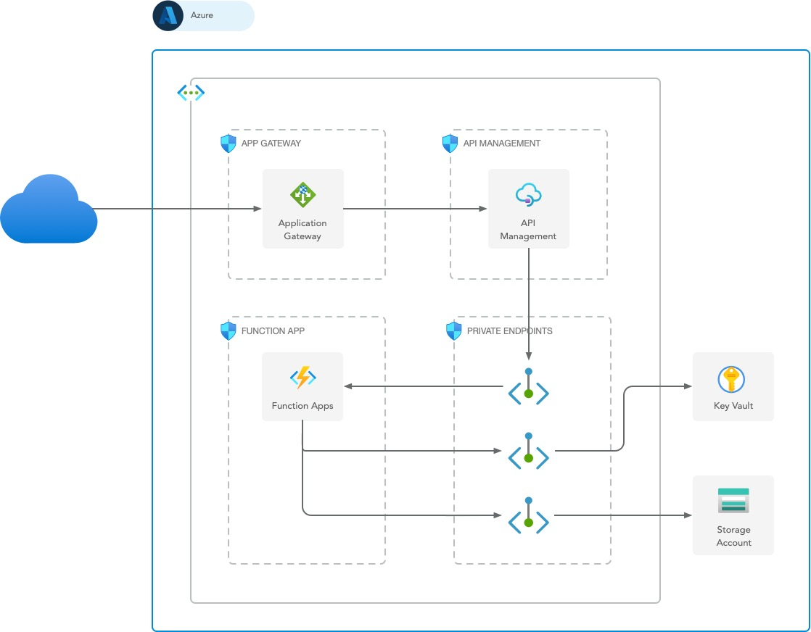

# API Management internal mode example

This repository contains example of API Management in internal mode.

# Architecture



# Deployment

To deploy required Azure Resources, go to `bicep` directory and execute following Azure CLI command:

```bash
az deployment group create \
    --resource-group {{resourceGroupName}} \
    --name {{deploymentName}} \
    --template-file main.bicep 
```

# License

Distributed under MIT License. See [LICENSE](LICENSE) for more details.